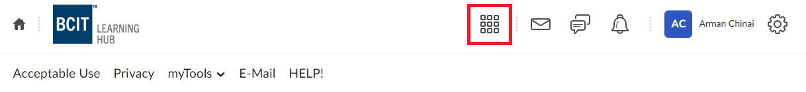
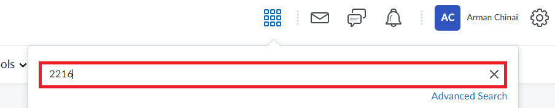
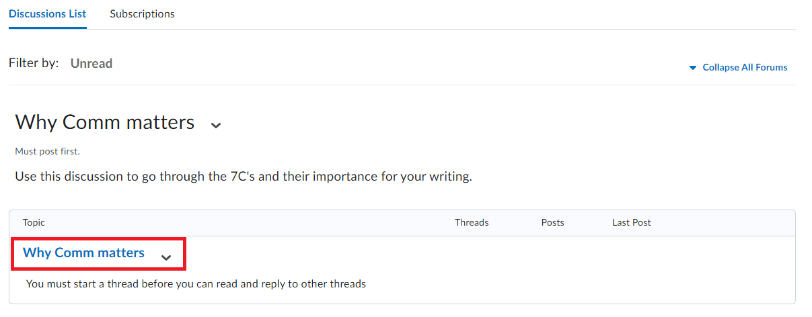
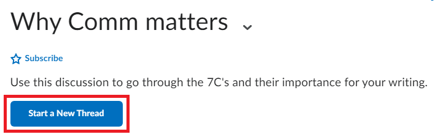
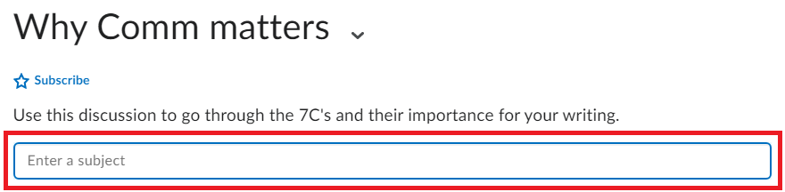

# Creating a Discussion Post

## Overview

This section will outline the steps needed to create a new discussion post. Students are able to create new threads or posts on discussion topics, which are created by the course instructor. While users are able to add images, formatting, and styling to their discussion posts, this user guide will only cover the steps to create a basic discussion post.

## Navigate to Class Homepage

Starting from the LearningHub homepage, users will need to navigate to the appropriate class’s homepage in order to submit an assignment.

1. **Click** on the Bento Menu in the header to view a drop down of enrolled classes.  
   {:style="display:block; margin-left:auto; margin-right:auto"}
2. **Type** course name and/or number in the search box and **Press** Enter.  
   {:style="display:block; margin-left:auto; margin-right:auto"}
3. **Click** on the class.
   {:style="display:block; margin-left:auto; margin-right:auto"}

## Navigate to Discussion Topic

After reaching the class homepage, users will need to navigate to a discussion topic to create a post.

1. **Click** on the ‘Activities’ dropdown menu in the top navigation bar.  
   {:style="display:block; margin-left:auto; margin-right:auto"}
2. **Click** on the ‘Discussions’ submenu  
   {:style="display:block; margin-left:auto; margin-right:auto"}
3. **Scroll** on the page to find the specified discussion and **Click** on the discussion topic’s name.  
   {:style="display:block; margin-left:auto; margin-right:auto"}

!!! note  
      Instructors are able to set close dates on discussion topics. Users must confirm that the discussion topic is still open for new discussions by checking the “Available until…” text directly below the discussion topic’s title to confirm that the date has not passed. If no text is below the discussion topic’s title, the discussion does not have a close date.  
      {:style="display:block; margin-left:auto; margin-right:auto"}

## Create a Discussion Post

Now inside of a discussion topic, the user can choose to either reply to an already existing post, or create their own post. This guide will focus on creating a new post.

1. **Click** on “Start a New Thread”  
   {:style="display:block; margin-left:auto; margin-right:auto"}
2. **Enter** a subject line for the discussion  
   {:style="display:block; margin-left:auto; margin-right:auto"}  
3. **Write** the discussion post  
   {:style="display:block; margin-left:auto; margin-right:auto"}  
4. **Click** on “Post”  
   {:style="display:block; margin-left:auto; margin-right:auto"}  
!!! warning
      The contents of this post will be visible to anyone who has access to the class's discussion board, and thus, should be inputted carefully.
!!! success
      Upon successfully creating a new discussion post, the discussion post will now be viewable at the top of the discussion board. The post will also be searchable by the subject line entered in the earlier steps.  
      {:style="display:block; margin-left:auto; margin-right:auto"}  

## Conclusion

By the end of this section, user’s will be able to:  

:material-check-circle:{ .green-checkmark }   Navigate to the Discussion section of the Learning Hub  
:material-check-circle:{ .green-checkmark }   Create their own discussion post on a discussion board  

Awesome work! Now let's learn how to
[join and leave a group](../JoiningandLeavingaGroup).
