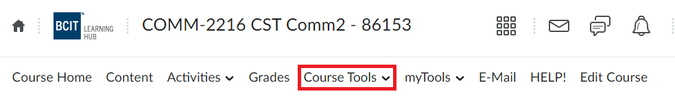
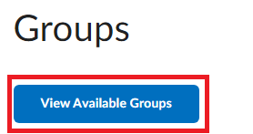
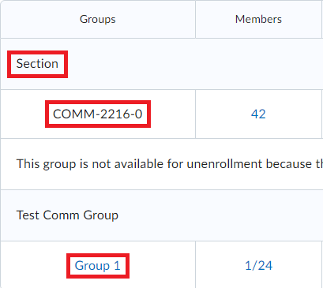
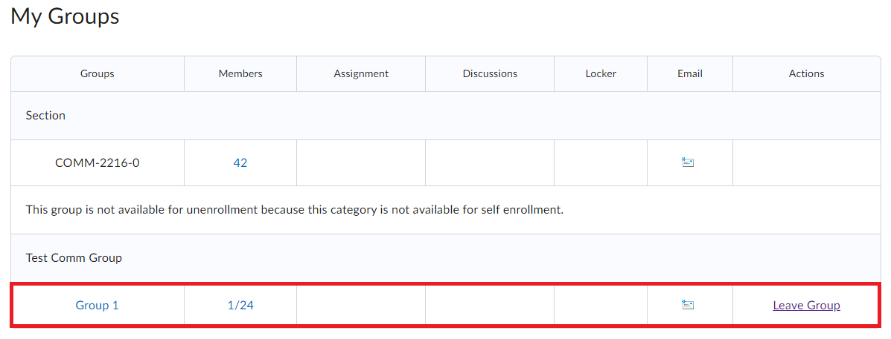

# Joining and Leaving a Group

## Overview

This section will outline the steps needed to join and leave a group. Instructors are able to set up groups on the LearningHub. Students can use these groups to complete assignments collaboratively. In some situations, a user’s group will be determined by the course instructor, while in other cases the instructor may choose to let the students choose their groups.

## Navigate to Class Homepage

Starting from the LearningHub homepage, users will need to navigate to the appropriate class’s homepage in order to submit an assignment.

1. **Click** on the Bento Menu in the header to view a drop down of enrolled classes.  
   {:style="display:block; margin-left:auto; margin-right:auto"}
2. **Type** course name and/or number in the search box and **Press** Enter.  
   {:style="display:block; margin-left:auto; margin-right:auto"}
3. **Click** on the class.
   {:style="display:block; margin-left:auto; margin-right:auto"}

## Navigate to Groups

After reaching the class homepage, users will need to navigate to the groups page to join a group.

1. **Click** on the ‘Course Tools’ dropdown menu in the top navigation bar.
    {:style="display:block; margin-left:auto; margin-right:auto"}
2. **Click** on the ‘Groups’ submenu
    {:style="display:block; margin-left:auto; margin-right:auto"}

## Join a Group

Now inside of the Groups tab, users will be able to see all of the groups they are actively a part of under the “My Groups” tab. At minimum, all users will be a part of the class wide group. The following steps will inform users how to join a new group.

1. **Click** on “View Available Groups”  
    {:style="display:block; margin-left:auto; margin-right:auto"}  
2. **Find** an available group to join and **Click** the “Join Group” button under the “Actions” column.
    {:style="display:block; margin-left:auto; margin-right:auto"}

!!! warning
        Users can only be a part of one group per group section at a time.  
        {:style="display:block; margin-left:auto; margin-right:auto"}

!!! note
        If the “Available Groups” tab displays the message “no items”, there are no available groups for users to join.  

!!! success
        Upon successfully joining a group, users will be redirected to the "My Groups" section, and will now see the new group.  
        {:style="display:block; margin-left:auto; margin-right:auto"}

## Leave a Group

The following set of instructions will inform users how to leave a group. To demonstrate this, the guide will walk through leaving the group we previously joined in the steps above, starting from the Groups screen with the “My Groups” section.

1. **Find** the desired group to leave in the “My Groups” Tab  
    {:style="display:block; margin-left:auto; margin-right:auto"}
2. **Click** “Leave Group” under the Action Column, in the same row as the desired group to leave.  
    {:style="display:block; margin-left:auto; margin-right:auto"}

!!! success
        Upon successfully leaving a group, users will no longer see the group under the “My Groups” Section.  
        {:style="display:block; margin-left:auto; margin-right:auto"}

## Conclusion

After completing this section, users should now be able to:  

:material-check-circle:{ .green-checkmark }   Navigate to the Group section of the Learning Hub  
:material-check-circle:{ .green-checkmark }   Join a group from the Available groups tab  
:material-check-circle:{ .green-checkmark }   Leave a group from their My Groups tab.  

Awesome work! Now let's learn how to
[create a discussion post](../CreatingaDiscussionPost).
