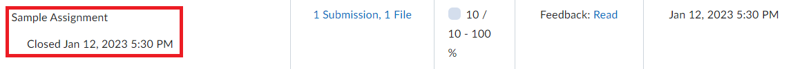
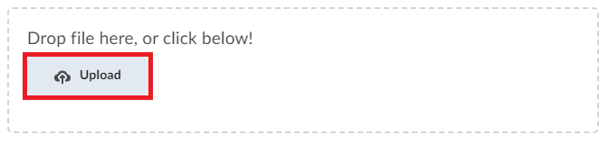
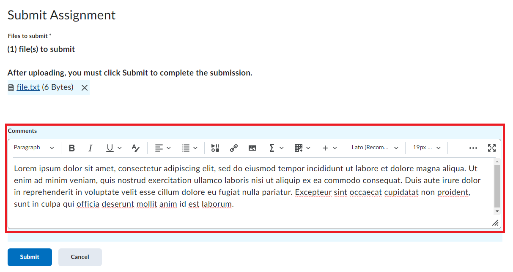

# Submitting an Assignment

## Overview

This section will outline the steps needed to submit an assignment on LearningHub. Users can submit text prompts, or upload files for submission. Other methods of submission are also available but they are not used in Computer Systems Technology. As such, this section will outline the conventional method of submissions.

## Navigate to Class Homepage

Starting from the LearningHub homepage, users will need to navigate to the appropriate class’s homepage in order to submit an assignment.

1. **Click** on the Bento Menu in the header to view a drop down of enrolled classes.  
   {:style="display:block; margin-left:auto; margin-right:auto"}
2. **Type** course name and/or number in the search box and **Press** Enter.  
   {:style="display:block; margin-left:auto; margin-right:auto"}
3. **Click** on the class.
   {:style="display:block; margin-left:auto; margin-right:auto"}

## Navigate to Assignment Submission Page

After reaching the class homepage, users will need to navigate to the submission page for the specific assignment.

1. **Click** on the ‘Activities’ dropdown menu in the top navigation bar.  
   {:style="display:block; margin-left:auto; margin-right:auto"}
2. **Click** on the ‘Assignments’ submenu  
   {:style="display:block; margin-left:auto; margin-right:auto"}
3. **Scroll** on the page to find the specified assignment and **Click** on the assignment name.  
   {:style="display:block; margin-left:auto; margin-right:auto"}

!!! note
        Assignments that are open for submission will be colored blue and will be clickable. Assignments not open to submission may either be not present on this page or will be present with the name greyed out and the close date listed.
        {:style="display:block; margin-left:auto; margin-right:auto"}

## Submitting

After reaching the assignment submission page, users will either be required to upload and submit files for submission, or enter a text prompt for submission.

### Text Submission

This subsection will outline the steps to submit a text prompt.

1. **Read** the submission requirements under the Instructions heading  
    {:style="display:block; margin-left:auto; margin-right:auto"}
2. **Type** text submission in the text editor.
    {:style="display:block; margin-left:auto; margin-right:auto"}
3. **Click** on Submit  
    {:style="display:block; margin-left:auto; margin-right:auto"}

!!! note
        The text editor contains formatting tools to style the text and add other pieces of content.  

!!! success
        Upon successful submission, an email will be sent to the users myBCIT email. The email will be from ‘The Learning Hub - BCIT’s Online Course Portal’ with the subject  ‘Submission receipt’. The content of the email will contain the Submission ID’, the date the assignment was received, the class name, as well as the name of any uploaded files.  
        {:style="display:block; margin-left:auto; margin-right:auto"}

### File Submission

This subsection will outline the steps to upload and submit a file for submission.

1. **Click** on ‘Add a File’  
    {:style="display:block; margin-left:auto; margin-right:auto"}
2. **Click** on ‘My Computer’.  
    {:style="display:block; margin-left:auto; margin-right:auto"}
3. **Click** on ‘Upload’.  
    {:style="display:block; margin-left:auto; margin-right:auto"}
4. **Find** the necessary files on the user’s computer in the file explorer popup that has now opened.  
    {:style="display:block; margin-left:auto; margin-right:auto"}
5. **Click** Open  
    {:style="display:block; margin-left:auto; margin-right:auto"}
6. **Click** Add  
    {:style="display:block; margin-left:auto; margin-right:auto"}
7. **Click** Submit  
    {:style="display:block; margin-left:auto; margin-right:auto"}

!!! note
        Users may also drag and drop files directly into the Upload box instead of manually uploading files.
        {:style="display:block; margin-left:auto; margin-right:auto"}

!!! note
        Multiple files can be selected at once by holding Ctrl and Clicking on each file.

!!! note
        Before clicking Submit, users may enter any comments in the Comments box.  
        {:style="display:block; margin-left:auto; margin-right:auto"}

!!! success
        Upon successful submission, an email will be sent to the users myBCIT email. The email will be from ‘The Learning Hub - BCIT’s Online Course Portal’ with the subject  ‘Submission receipt’. The content of the email will contain the Submission ID’, the date the assignment was received, the class name, as well as the name of any uploaded files.  
        {:style="display:block; margin-left:auto; margin-right:auto"}

## Conclusion

By the end of this section, user’s will be able to:  

:material-check-circle:{ .green-checkmark }   Submit a text prompt for submission  
:material-check-circle:{ .green-checkmark }   Upload and submit files for submission  

Awesome work! Now let's learn how to
[create a discussion Post](../CreatingaDiscussionPost).
