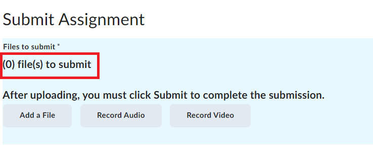
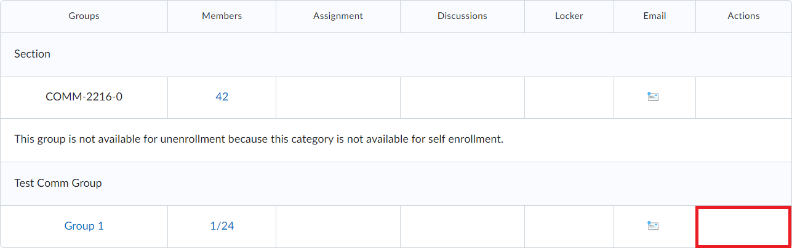
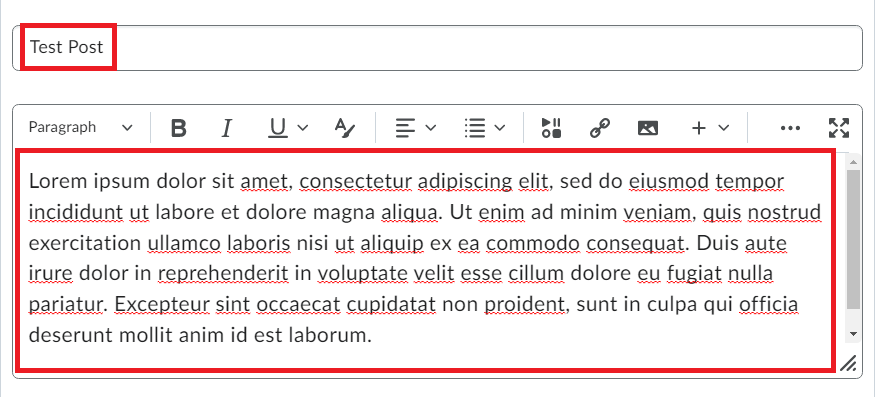

# Troubleshooting

## Overview

This section will troubleshoot common errors and problems users might encounter when completing the guided tasks. Some common problems are not fixable through the users student access to LearningHub. These issues will also be described below.

## Problems

### How do I remove an uploaded file from an assignment?

Users may accidentally upload a file to an assignment or make changes to a file and need to reupload. This section will discuss how to fix this issue. Starting from the submission screen where users can add files.  

1. **Click** on the small x next to the file's name.
    {:style="display:block; margin-left:auto; margin-right:auto"}

!!! success
    The assignment's name will be crossed out in the list of attached files.
    {:style="display:block; margin-left:auto; margin-right:auto"}

### How do I leave a group if the "Leave Group" button is not visible?

Users may choose to leave a group for a variety of reasons, such as choosing to collaborate with different classmates. However, the user may notice that on some groups, the "Leave Group" button will not be visible under the "Action" column. The instructor dictates the permissions available when interacting with the Groups Tab. If no “Leave Group” button is available in the “Action” column, users must contact their instructor to be manually removed from the group.  

!!! failure "Not Possible"
    This task cannot be completed due to a user restriction.
    {:style="display:block; margin-left:auto; margin-right:auto"}

### How do I edit my discussion post?

After creating a discussion post, users may feel the need to update their post with more content, or remove mistakes. Starting from the discussion board with the post to be edited.

1. **Find** the post.
    {:style="display:block; margin-left:auto; margin-right:auto"}
2. **Click** on the downward arrow menu.
    {:style="display:block; margin-left:auto; margin-right:auto"}
3. **Click** on “Edit Thread."
    {:style="display:block; margin-left:auto; margin-right:auto"}
4. **Edit** the post.
    {:style="display:block; margin-left:auto; margin-right:auto"}
5. **Click** on “Update.”
    {:style="display:block; margin-left:auto; margin-right:auto"}

!!! success
    A notification will appear at the bottom of the screen indicating that the post has been successfully updated.
    {:style="display:block; margin-left:auto; margin-right:auto"}

### How do I make a discussion post when the "Start a New Thread" button is not visible?

If the “Start New Thread” button is not visible on a Discussion Board, that means the window to submit new Discussion Posts has closed. Some Discussion Boards have due dates which require students to make their posts before a specific deadline.

!!! failure "Not Possible"
    At this point, there is no way to create a post on the board as the window for new posts has closed.
    {:style="display:block; margin-left:auto; margin-right:auto"}

### How do I resubmit an assignment?

Users may choose to resubmit an assignment to update files or add a new file. Unless the assignment has a limitation on the number of submissions, assignments can be resubmitted multiple times following the same set of instructions as provided in the Submitting an Assignment section.  

### How do I delete my discussion post?

1. **Navigate** to the Discussion Board and **Find** the post to be edited.
    {:style="display:block; margin-left:auto; margin-right:auto"}
2. **Click** on the downward arrow menu.
    {:style="display:block; margin-left:auto; margin-right:auto"}
3. **Click** on “Delete Thread.”
    {:style="display:block; margin-left:auto; margin-right:auto"}
4. **Click** on “Yes”
    {:style="display:block; margin-left:auto; margin-right:auto"}

!!! success
    A notification will appear at the bottom of the screen indicating that the post has been successfully deleted.
    {:style="display:block; margin-left:auto; margin-right:auto"}

## Conclusion

After completing this section, users should now be able to:  

:material-check-circle:{ .green-checkmark }   Resolve common issues that occur when completing the detailed tasks.

Bravo! Take a gander at the [glossary](../glossary) for definitions on terminology used throughout the user guide.
